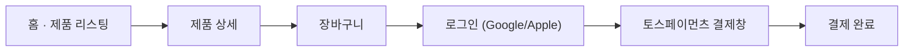

# 🛒 ARENA — 라이프스타일 이커머스 웹사이트

> 제품 탐색부터 결제까지, 하나의 흐름으로 이어지는 라이프스타일 이커머스 웹사이트

<p>
  
  
  
  
  
  
</p>

## 🖼️ 데모
| 홈 · 제품 리스팅 | 제품 상세 | 결제 화면 |
|---|---|---|
| (스크린샷 삽입) | (스크린샷 삽입) | (스크린샷 삽입) |

배포 링크: https://arena-eta-five.vercel.app/

## ✨ 주요 기능 & 인터랙션

### 1. 소셜 로그인 (Google · Apple)
회원가입 절차 없이 **Google, Apple 계정으로 바로 로그인**할 수 있도록 연동했습니다. 이커머스 특성상 결제 직전 이탈을 줄이기 위해, 로그인 장벽을 최소화하는 데 초점을 맞췄습니다.
> (실제 인증 흐름 — Firebase Authentication 연동 방식 등 — 을 채워주세요.)

### 2. 제품 리스팅 · 상세 페이지
카테고리별로 제품을 탐색하고, 제품 상세 페이지에서 이미지·옵션·가격 정보를 확인할 수 있습니다.
> (필터링, 정렬, 옵션 선택 등 실제 구현된 UI 동작을 채워주세요.)

### 3. 토스페이먼츠 SDK v2 결제 연동
장바구니에서 결제까지 이어지는 흐름에 **토스페이먼츠 SDK v2**를 연동해 결제창을 띄우고 결제를 완료합니다.
> (결제 요청 → 승인 → 완료 화면까지의 구체적인 흐름을 채워주세요.)

## 🧭 사용자 플로우


## 🗂️ 폴더 구조
```
arena/
├── imgees/              # 제품·배너 이미지 에셋
├── public/               # 정적 파일 (히어로 배너, 브랜드 캐러셀 등)
├── src/
│   ├── components/        # 공통 UI 컴포넌트
│   ├── pages/              # 라우트별 화면 (react-router-dom)
│   ├── firebase.ts         # Firebase 초기화 · 인증
│   └── ...
├── index.html
├── vite.config.ts
├── tsconfig.json
└── package.json
```

## 🤖 AI 활용 프로세스
이 프로젝트는 기획 초안부터 코드 구현까지 각 단계에서 AI를 1차 초안 생성 도구로 활용하고, 그 결과를 검증·수정하는 방식으로 진행했습니다.

**① 기획 단계 —**
> (너는 지금부터 10년차 uxui 디자너 겸 기획자야 
아레나 수경 이커머스 사이트라는 주제로 웹사이트를 제작하려고해
유져들에게 웹사이트에서 앱사이트를 사용하는 경험을 주면서 새로운 경험을 제공하고 싶어 . 어떤 방법들이 있는지 확인해줘. 
)

**② 디자인 단계 —**
> (너는 지금부터 20년차 uxui디자이너야 
지금부터 아레나 수경 이커머스 사이트를 디자인 하려고해 
내가 원하는 스타일은 물방울 느낌이 났으면 좋겠고 
매인 컬러는 네이비 ,서브 컬러는 파스텔 톤이 들어갓으면 좋겠어 
컬러들이 너무 쩅하면 ai 티가 너무 나니깐 톤을 조금 조절 해줫으면 좋겠어 .)

**③ 개발 단계 — 결제 연동**
> (토스와,구글 api 키를 받아 왔어 그후 env 파일 안에 담아 두었어 
위 키값들을 확인한후 실제 연동후 구현이 가능하게 제작해줘.)

## 🩹 트러블슈팅
| 이슈 | 원인 | 해결 |
|---|---|---|
| 전역 폰트 굵기 불일치 | 컴포넌트별 font-weight 개별 지정 | 전역 폰트 굵기 리팩토링 |
| (결제/로그인 관련 이슈) | (원인) | (해결) |

## 📄 링크
피그마:https://www.figma.com/design/jWl7Py1lPrQySJ3eVRsqv7/%EC%95%84%EB%A0%88%EB%82%98-%EC%88%98%EA%B2%BD-%EC%95%B1%EC%9B%B9-%EC%9D%B4%EC%BB%A4%EB%A8%B8%EC%8A%A4?node-id=0-1&t=bp5HXdOLYx53XrDg-1

노션:https://app.notion.com/p/Project-2-E-Commerce-Web-Design-Development-a711a4be835a83a5adf30188242c7aa6

배포주소:https://arena-eta-five.vercel.app/

깃허브:https://github.com/tmdnd0568/arena

노트폴리오:https://notefolio.net/aivibe001/466147
